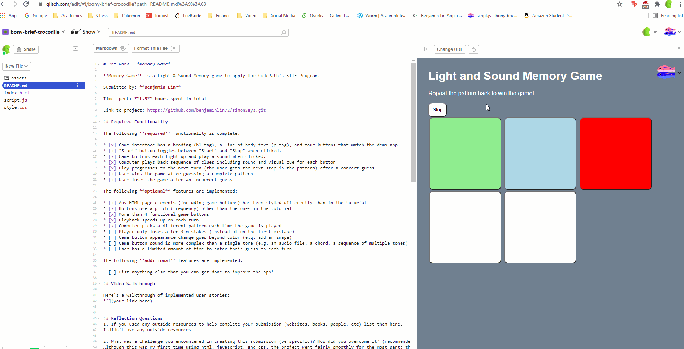

# Pre-work - *Memory Game*

**Memory Game** is a Light & Sound Memory game to apply for CodePath's SITE Program. 

Submitted by: **Benjamin Lin**

Time spent: **1.5** hours spent in total

Link to project: https://github.com/benjaminlin72/simonSays.git

## Required Functionality

The following **required** functionality is complete:

* [x] Game interface has a heading (h1 tag), a line of body text (p tag), and four buttons that match the demo app
* [x] "Start" button toggles between "Start" and "Stop" when clicked. 
* [x] Game buttons each light up and play a sound when clicked. 
* [x] Computer plays back sequence of clues including sound and visual cue for each button
* [x] Play progresses to the next turn (the user gets the next step in the pattern) after a correct guess. 
* [x] User wins the game after guessing a complete pattern
* [x] User loses the game after an incorrect guess

The following **optional** features are implemented:

* [x] Any HTML page elements (including game buttons) has been styled differently than in the tutorial
* [x] Buttons use a pitch (frequency) other than the ones in the tutorial
* [x] More than 4 functional game buttons
* [x] Playback speeds up on each turn
* [x] Computer picks a different pattern each time the game is played
* [ ] Player only loses after 3 mistakes (instead of on the first mistake)
* [ ] Game button appearance change goes beyond color (e.g. add an image)
* [ ] Game button sound is more complex than a single tone (e.g. an audio file, a chord, a sequence of multiple tones)
* [ ] User has a limited amount of time to enter their guess on each turn

The following **additional** features are implemented:

- [ ] List anything else that you can get done to improve the app!

## Video Walkthrough

Here's a walkthrough of implemented user stories:

## Reflection Questions
1. If you used any outside resources to help complete your submission (websites, books, people, etc) list them here.  
I didn't use any outside resources.

2. What was a challenge you encountered in creating this submission (be specific)? How did you overcome it? (recommended 200 - 400 words)  
Although this was my first time using html, javascript, and css, the project went fairly smoothly for the most part; the instructions
were very well written.  
I had a slight challenge when trying to create a randomized sequence. Initially my code was just Math.floor(Math.random() * 5).
Sometimes a random sequence would be generated and I would be able to play a few turns, but often it would break in the middle of a game.
First, I hardcoded the sequence in my method to make sure everything else was working correctly, and it was.
After testing some more I noticed that it would never use the fifth button. Then I realized that because I was flooring the value, 
it would generate numbers from 0 to 4, not from 1 to 5 like everything else was.
So I changed the code to Math.floor(Math.random() * 5) + 1 and this worked.

3. What questions about web development do you have after completing your submission? (recommended 100 - 300 words)   
I'm interested in how communication between front end and back end works on larger projects. For this project the design
of the html and the javascript were intrinsically tied together. On larger projects where multiple people are working on each file
it seems difficult to keep everything in sync. I assume that this is solved through documentation, but I would like to learn more
about how that is done.  
I'm also interested in how to design user friendly webpages. Online I've had experiences with well designed and poorly designed
webpages and so know just how big the difference can be. With this project, I did not play around with the look and feel of the game
too much, but I would like to learn more about how one would go about making a game like this one look and feel better.

4. If you had a few more hours to work on this project, what would you spend them doing (for example: refactoring certain functions, adding additional features, etc). Be specific. (recommended 100 - 300 words)   
First I would spend time on some documentation, both commenting the code itself and creating a proper ReadMe file.
Although most of the methods are fairly self explanatory, it would still help in the future to have comments.
Second, I would like to add a feature to allow players to choose the length of the sequence, probably using a slider. When programming
the different functions I avoided hardcoding sequence length (for example my random sequence generator takes in the length as a parameter
instead of just generating 8 values). It also seems like a natural extension to allow for the game to have varying difficulty.  
Third, I might change some of the timings. Currently I reduce hold time by 20% each turn, which felt pretty good, but with more
testing I think I could get the game to feel even better.

## License

    Copyright Benjamin Lin

    Licensed under the Apache License, Version 2.0 (the "License");
    you may not use this file except in compliance with the License.
    You may obtain a copy of the License at

        http://www.apache.org/licenses/LICENSE-2.0

    Unless required by applicable law or agreed to in writing, software
    distributed under the License is distributed on an "AS IS" BASIS,
    WITHOUT WARRANTIES OR CONDITIONS OF ANY KIND, either express or implied.
    See the License for the specific language governing permissions and
    limitations under the License.